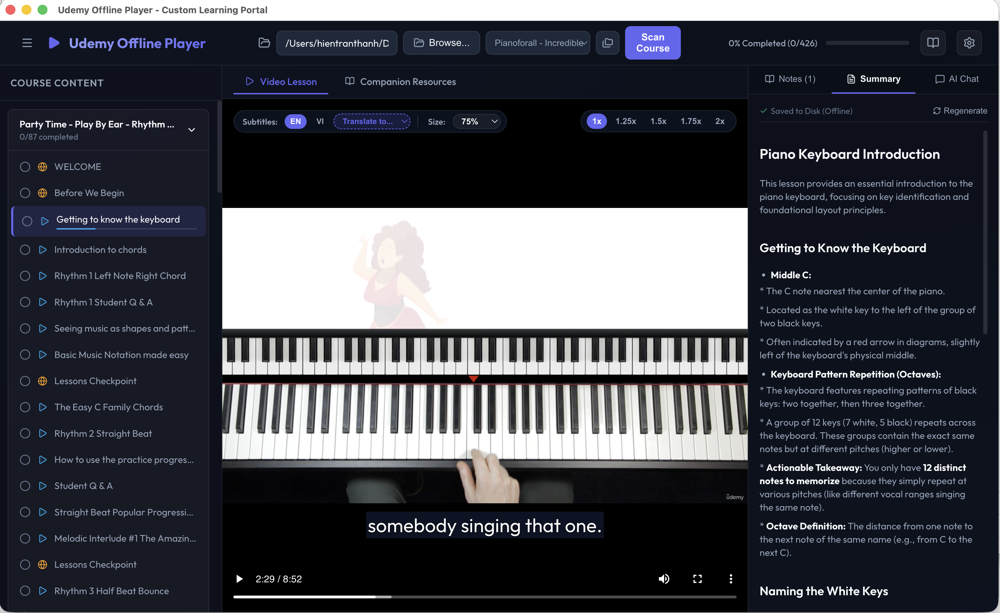

# 🎓 Udemy Offline Player

A local learning portal for Udemy courses — stream, study, and master any course offline.

<p align="center">
  
</p>

---

## ✨ Features Built for Power Learners

This player is built to help you learn faster and retain more information:

1. **Intelligent Course Scanner**: Point the player at your downloaded course folder. It automatically organizes lessons, chapters, and companion files into a clean sidebar menu. (Auto-generated `.chapters.json` and `.summary.*.txt` files are automatically filtered out to keep your companion resources list clean and uncluttered.)
2. **Coordinated Tab View**: Study side-by-side. If a lesson contains both a video and companion resources (like PDFs or cheat sheets), the player shows them together in coordinated tabs.
3. **Custom HTML5 Video Stage**:
   - Supports adjustable playback speeds (`1x`, `1.25x`, `1.5x`, `1.75x`, `2x`).
   - **Theater Mode** (`t`): collapses headers and sidebars with smooth animated transitions for a distraction-free viewing experience. A floating tab bar overlays the video area, letting you switch between video and companion resources or exit theater mode without leaving full focus.
   - **Auto-Hide Floating Controls**: overlay panels (subtitles, speed, autoplay, panel toggles) fade out after 2.5s of mouse inactivity while the video plays, keeping the focus on the content.
   - **Subtitle Size Control**: fine-tune subtitle display from 50% to 160%.
   - Browser hotkeys: `Space` (play/pause), `Arrow Left/Right` (skip 5 seconds), `Arrow Up/Down` (volume), `F` (fullscreen), `B` (sidebar), `N` (notes), `C` (toggle chapters panel), and `T` (theater mode).
4. **Interactive Notes Timeline**: Type notes as you watch. The player pauses the video automatically while you type, and links each note to a click-to-seek timestamp.
5. **Auto-Completion & Auto-Save**: Lessons are marked complete at `90%` watch progress. Your playback position saves every 5 seconds so you can resume exactly where you left off.
6. **AI Subtitle Translation**: Automatically translate English subtitle tracks to your native language using the built-in Gemini API.
7. **Dual Subtitle Display**: Watch with two subtitle tracks simultaneously (e.g., English + your native language). The player merges both WebVTT tracks in real time, showing the secondary language in a distinct style below the primary subtitles.
8. **Offline AI Summarization**: Generate structured, bulleted summaries of video lessons in any supported language — independent of the active subtitle track. Choose your preferred output language via the dropdown selector. Summaries cache locally, letting you review them instantly without internet access.
9. **Transcript-Grounded AI Chat**: Ask questions about the lesson in the chat sidebar. The AI answers using the active subtitle transcript as context.
10. **Auto-Generated Timeline Chapters**: The player automatically analyzes lesson subtitle transcripts via the Gemini API to generate structured video chapters on the playback timeline, allowing you to easily browse and jump to different sections of the video.
11. **Video Duration Display**: The sidebar shows individual lesson durations, section totals, and overall course duration, helping you plan your study sessions.
12. **Dynamic Window Title**: The window/document title updates to show the currently playing lesson and its playback status (▶ playing / ⏸ paused).

---

## 🛠️ Developer Setup & Project Run

### Project Structure

```
udemy-player/
├── backend/
│   ├── server.js          # Express server with range-streaming, VTT conversion, & persistence APIs
│   ├── scanner.js         # File grouping and section sorting scanner
│   ├── progress_db.json   # Local user notes and completion database (JSON)
│   └── package.json       # Backend server dependencies
├── docs/                  # Technical specifications, implementation plans, and task lists
├── frontend/              # Vite React client
│   ├── src/
│   │   ├── components/    # CourseSelector, Sidebar, VideoPlayer, DocViewer, NotesPanel
│   │   ├── App.jsx        # App logic controller
│   │   ├── main.jsx       # Client entry
│   │   └── index.css      # Dark-mode styling tokens and layout rules
│   ├── vite.config.js     # Dev server proxy configuration
│   └── package.json       # Client dependencies
├── package.json           # Root runner scripts (starts concurrently)
└── README.md              # Project documentation
```

### Prerequisites
* [Node.js](https://nodejs.org/) (v16+)

### 1. Install Dependencies
Install all root, client, and server dependencies in one command:
```bash
npm run install:all
```

### 2. Start the Development Stack
Start both the API backend (Express on port `3003`) and client frontend (Vite on port `3002`) concurrently:
```bash
npm run dev
```

### 3. Open in Browser
Visit **[http://localhost:3002](http://localhost:3002)** to browse and play your courses.

### 4. Running the Desktop App (macOS DMG)
To package and run the application as a standalone desktop app on macOS:
1. Build the frontend and compile the package:
   ```bash
   npm run package
   ```
2. Drag **Udemy Offline Player.app** from `dist-desktop/` to your `/Applications` folder.
3. If macOS Gatekeeper blocks the app from running, remove the quarantine attribute and self-sign it:
   ```bash
   # Remove the quarantine attribute
   xattr -cr /Applications/Udemy\ Offline\ Player.app

   # Self-sign the application
   codesign --force --deep --sign - /Applications/Udemy\ Offline\ Player.app
   ```
4. Launch the application normally from Applications or Launchpad.

---

## 🔒 API Endpoints

* **`GET /api/course-content?path=<absolute-path>`**: Scans the folder and returns grouped chapters and lesson resources.
* **`GET /api/stream?path=<video-file-path>`**: Streams local video assets supporting Byte-Range header requests.
* **`GET /api/subtitle?path=<subtitle-file-path>`**: Feeds SubRip (`.srt`) contents converted to WebVTT format on-the-fly.
* **`GET /api/resource?path=<document-file-path>`**: Serves PDFs and HTML checkpoints securely.
* **`GET /api/userdata`**: Returns completion logs, note timelines, and active paths.
* **`POST /api/userdata/course`**: Scans and adds new course path to recent history.
* **`POST /api/userdata/progress`**: Updates completion states and watch logs.
* **`POST /api/userdata/notes`**: Inserts or updates annotation notes.
* **`DELETE /api/userdata/notes`**: Removes note entries from a lesson timeline.
* **`POST /api/userdata/settings`**: Saves application settings (such as the Gemini API Key).
* **`POST /api/translate-subtitle`**: Translates subtitles using the Gemini API.
* **`POST /api/summarize-lesson`**: Generates and caches lesson summaries.
* **`POST /api/chat-lesson`**: Chat assistant grounded in the subtitles transcript.
* **`POST /api/browse-folder`**: Launches native OS folder dialog window.
* **`GET /api/chapters?videoPath=<path>&subtitlePath=<path>`**: Loads cached timeline chapters or generates them from subtitles via Gemini.
* **`POST /api/chapters/regenerate`**: Forces regeneration of timeline chapters using subtitles and overwrites the local cache.
