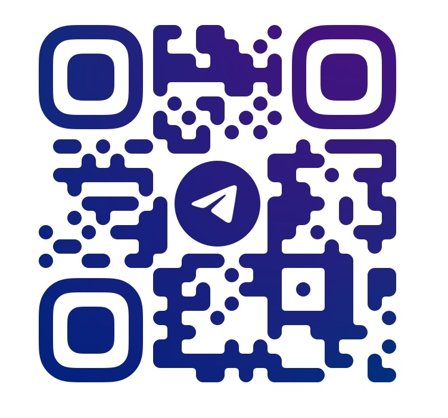

# 🎓 Udemy Offline Player

Your Premium Local Learning Portal — Stream, Study & Master Any Course Offline

[](#-buy-premium-udemy-courses--unbelievably-cheap)
[](#-buy-premium-udemy-courses--unbelievably-cheap)
[](#-buy-premium-udemy-courses--unbelievably-cheap)
[](#-buy-premium-udemy-courses--unbelievably-cheap)

<p align="center">
  
</p>

---

## 🎬 See How It Works

Watch our quick walkthrough to see how easy it is to set up your local study portal.

<p align="center">
  <a href="https://www.youtube.com/watch?v=U0gidDeZN0I">
    
  </a>
</p>

<p align="center">
  ▶️ <a href="https://www.youtube.com/watch?v=U0gidDeZN0I"><strong>Watch the guide on YouTube</strong></a>
</p>

---

## 🔥 Buy Premium Udemy Courses — Unbelievably Cheap

Why pay $50 to $200 per course when you can get the exact same content for a fraction of the price?

We provide access to **thousands of top-rated Udemy courses** at the lowest prices available. Every purchase includes:

| What You Get | Details |
|---|---|
| 💰 **Rock-Bottom Prices** | Courses starting from just **$3 to $5** — save up to **95%** off retail |
| ♾️ **Lifetime Updates** | If the instructor updates the course, you get the updates for free, forever |
| 📥 **Full Offline Access** | Download the course once and learn anywhere — no internet required |
| 🎬 **Complete Content** | All videos, high-quality subtitles, resources, and project attachments included |
| 🤖 **AI-Powered Player** | Built-in AI translation, structured summarization, and chat assistant |
| ⚡ **Instant Delivery** | Get your download link within minutes of placing an order |
| 🛡️ **100% Safe** | Clean, secure files with no malware and no subscription lock-ins |

### 📲 Ready to Order? Contact Us Now!

<p align="center">
  <a href="https://t.me/nhp2024">
    
  </a>
</p>

<p align="center">
  Scan the QR code or click the image to message us on <strong>Telegram</strong>. Browse our catalog and place your order.
  <br/>
  <em>Special offer: First-time buyers get a special discount. Ask about our bundle deals.</em>
</p>

---

## 💎 Why Choose Us Over Buying Directly?

Compare how our local portal matches up against buying directly from Udemy:

| Feature | Buying from Udemy | Learning with Us |
|---|---|---|
| **Price** | $50 to $200 per course | **$3 to $5 per course** |
| **Updates** | Only while subscribed or active | **Lifetime updates included free** |
| **Offline Access** | Limited mobile download only | **Full desktop and mobile offline access** |
| **AI Features** | None | **Translation, summarization, and chat** |
| **Subtitles** | English-only for most courses | **Auto-translate subtitles to any language** |
| **Notes & Progress** | Basic bookmarks | **Timestamped notes + auto-save progress** |

---

## ✨ Features Built for Power Learners

This player is built to help you learn faster and retain more information:

1. **Intelligent Course Scanner**: Point the player at your downloaded course folder. It automatically organizes lessons, chapters, and companion files into a clean sidebar menu.
2. **Coordinated Tab View**: Study side-by-side. If a lesson contains both a video and companion resources (like PDFs or cheat sheets), the player shows them together in coordinated tabs.
3. **Custom HTML5 Video Stage**:
   - Supports adjustable playback speeds (`1x`, `1.25x`, `1.5x`, `1.75x`, `2x`).
   - Browser hotkeys: `Space` (play/pause), `Arrow Left/Right` (skip 5 seconds), `Arrow Up/Down` (volume), and `F` (fullscreen toggle).
4. **Interactive Notes Timeline**: Type notes as you watch. The player pauses the video automatically while you type, and links each note to a click-to-seek timestamp.
5. **Auto-Completion & Auto-Save**: Lessons are marked complete at `90%` watch progress. Your playback position saves every 5 seconds so you can resume exactly where you left off.
6. **AI Subtitle Translation**: Automatically translate English subtitle tracks to your native language using the built-in Gemini API.
7. **Offline AI Summarization**: Generate structured, bulleted summaries of video lessons. The summaries cache locally, letting you review them instantly without internet access.
8. **Transcript-Grounded AI Chat**: Ask questions about the lesson in the chat sidebar. The AI answers using the active subtitle transcript as context.

---

## 🛠️ Developer Setup & Project Run

If you want to run the project locally, build it, or modify the code, follow these technical instructions.

### Project Structure

```
udemy-player/
├── backend/
│   ├── server.js          # Express server with range-streaming, VTT conversion, & persistence APIs
│   ├── scanner.js         # File grouping and section sorting scanner
│   ├── progress_db.json   # Local user notes and completion database (JSON)
│   └── package.json       # Backend server dependencies
├── docs/                  # Technical specifications, implementation plans, and task lists
├── frontend/              # Vite React client
│   ├── src/
│   │   ├── components/    # CourseSelector, Sidebar, VideoPlayer, DocViewer, NotesPanel
│   │   ├── App.jsx        # App logic controller
│   │   ├── main.jsx       # Client entry
│   │   └── index.css      # Dark-mode styling tokens and layout rules
│   ├── vite.config.js     # Dev server proxy configuration
│   └── package.json       # Client dependencies
├── package.json           # Root runner scripts (starts concurrently)
├── telegram.jpg           # Telegram contact image/QR code
└── README.md              # Project documentation
```

### Prerequisites
* [Node.js](https://nodejs.org/) (v16+)

### 1. Install Dependencies
Install all root, client, and server dependencies in one command:
```bash
npm run install:all
```

### 2. Start the Development Stack
Start both the API backend (Express on port `3003`) and client frontend (Vite on port `3002`) concurrently:
```bash
npm run dev
```

### 3. Open in Browser
Visit **[http://localhost:3002](http://localhost:3002)** to browse and play your courses.

### 4. Running the Desktop App (macOS DMG)
To package and run the application as a standalone desktop app on macOS:
1. Build the frontend and compile the package:
   ```bash
   npm run package
   ```
2. Drag **Udemy Offline Player.app** from `dist-desktop/` to your `/Applications` folder.
3. If macOS Gatekeeper blocks the app from running, remove the quarantine attribute and self-sign it:
   ```bash
   # Remove the quarantine attribute
   xattr -cr /Applications/Udemy\ Offline\ Player.app
   
   # Self-sign the application
   codesign --force --deep --sign - /Applications/Udemy\ Offline\ Player.app
   ```
4. Launch the application normally from Applications or Launchpad.

---

## 🔒 API Endpoints

* **`GET /api/course-content?path=<absolute-path>`**: Scans the folder and returns grouped chapters and lesson resources.
* **`GET /api/stream?path=<video-file-path>`**: Streams local video assets supporting Byte-Range header requests.
* **`GET /api/subtitle?path=<subtitle-file-path>`**: Feeds SubRip (`.srt`) contents converted to WebVTT format on-the-fly.
* **`GET /api/resource?path=<document-file-path>`**: Serves PDFs and HTML checkpoints securely.
* **`GET /api/userdata`**: Returns completion logs, note timelines, and active paths.
* **`POST /api/userdata/course`**: Scans and adds new course path to recent history.
* **`POST /api/userdata/progress`**: Updates completion states and watch logs.
* **`POST /api/userdata/notes`**: Inserts or updates annotation notes.
* **`DELETE /api/userdata/notes`**: Removes note entries from a lesson timeline.
* **`POST /api/userdata/settings`**: Saves application settings (such as the Gemini API Key).
* **`POST /api/translate-subtitle`**: Translates subtitles using the Gemini API.
* **`POST /api/summarize-lesson`**: Generates and caches lesson summaries.
* **`POST /api/chat-lesson`**: Chat assistant grounded in the subtitles transcript.
* **`POST /api/browse-folder`**: Launches native OS folder dialog window.

---

<p align="center">
  <strong>Join learners who saved 95% on premium Udemy courses.</strong><br/>
  💬 Message us on <strong>Telegram</strong> today — tell us what you want to learn, and we'll get it for you!
</p>

<p align="center">
  <em>© 2026 Udemy Offline Player — Learn Smart, Pay Less ❤️</em>
</p>
