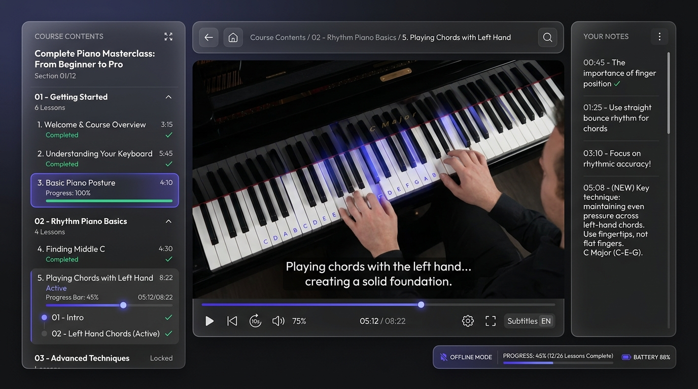

# Udemy Offline Player

A premium, local web-based learning portal to play and manage offline-downloaded Udemy courses. Bypass browser sandbox restrictions to stream videos, load SubRip subtitles, read companion sheets, mark completion status, and record interactive notes.
<p align="center">
  
</p>

---

## Buy Udemy Courses & Contact

Looking to purchase high-quality Udemy courses? We offer a vast library of premium courses at friendly rates. You can play all purchased courses offline using this Udemy Offline Player!

To check our catalog or place an order, scan the QR code below or reach out directly on Telegram:

<p align="center">
  
</p>

---

## Key Features

1. **Intelligent Course Scanner**: Scans directory folders and sections (e.g. `01 - Party Time...`, `02 - Blues...`) to build a structured navigation menu. Groups video files, SRT subtitle files, and resource materials (PDFs, HTML sheets) sharing the same leading number suffix (e.g. `03 - Getting to know the keyboard`) into single, coherent Lesson objects.
2. **Coordinated Tab View**: If a lesson has both a video and a document resource (like sheet music PDFs in section 1 of *Pianoforall*), the player stage reveals a tab system: **Video Lesson** and **Companion Resources**, allowing seamless side-by-side study.
3. **Custom HTML5 Video Stage**:
   - Converts standard `.srt` subtitle files to WebVTT (`.vtt`) on-the-fly.
   - Built-in adjustable playback rate options (`1x`, `1.25x`, `1.5x`, `1.75x`, `2x`).
   - Browser hotkeys: `Space` (play/pause), `ArrowLeft`/`ArrowRight` (skip back/forward 5 seconds), `ArrowUp`/`ArrowDown` (volume), and `F` (fullscreen toggle).
4. **Interactive Notes Timeline**: Pauses the video automatically when you start typing a note. Note entries are logged with click-to-seek timestamp badges; clicking a note badge seeks the video player to that exact second.
5. **Auto-Completion & Auto-Save**: Auto-completes a video lesson when watch progress reaches `90%`. Periodically saves current playback timestamps every 5 seconds to local storage so you can resume precisely where you paused.
6. **Premium Dark Theme Layout**: Responsive design crafted with custom Vanilla CSS variables, visual hierarchy grid panels, and glassmorphism styling.

---

## Project Structure

```
udemy-player/
├── backend/
│   ├── server.js          # Express server with range-streaming, VTT conversion, & persistence APIs
│   ├── scanner.js         # File grouping and section sorting scanner
│   ├── progress_db.json   # Local user notes and completion database (JSON)
│   └── package.json       # Backend server dependencies
├── docs/                  # Technical specifications, implementation plans, and task lists
├── frontend/              # Vite React client
│   ├── src/
│   │   ├── components/
│   │   │   ├── CourseSelector.jsx # Course folder scanner input & history
│   │   │   ├── Sidebar.jsx        # Chapter accordion menu & completion logs
│   │   │   ├── VideoPlayer.jsx    # Media streaming stage with hotkeys & speeds
│   │   │   ├── DocViewer.jsx      # Local PDF embeds & HTML checkpoint iframes
│   │   │   └── NotesPanel.jsx     # Annotation manager with timestamp seeks
│   │   ├── App.jsx        # App logic controller
│   │   ├── main.jsx       # Client entry
│   │   └── index.css      # Dark-mode styling tokens and layout rules
│   ├── vite.config.js     # Dev server proxy configuration
│   └── package.json       # Client dependencies
├── package.json           # Root runner scripts (starts concurrently)
├── telegram.jpg           # Telegram contact image/QR code
└── README.md              # This setup guide
```

---

## Setup & Running

### Prerequisites
* [Node.js](https://nodejs.org/) (v16+)

### 1. Install Dependencies
Install all root, client, and server dependencies in one go:
```bash
npm run install:all
```

### 2. Start the Development Stack
Start both the API backend (Express on port `3003`) and client frontend (Vite on port `3002`) concurrently:
```bash
npm run dev
```

### 3. Open in Browser
Visit **[http://localhost:3002](http://localhost:3002)** to browse and play your courses.

---

## API Endpoints

* **`GET /api/course-content?path=<absolute-path>`**: Scans the folder and returns grouped chapters and lesson resources.
* **`GET /api/stream?path=<video-file-path>`**: Streams local video assets supporting Byte-Range header requests (allows seeking).
* **`GET /api/subtitle?path=<subtitle-file-path>`**: Feeds SubRip (`.srt`) contents converted to WebVTT format on-the-fly.
* **`GET /api/resource?path=<document-file-path>`**: Serves PDFs and HTML checkpoints securely with appropriate MIME types.
* **`GET /api/userdata`**: Returns completion logs, note timelines, and active paths from `progress_db.json`.
* **`POST /api/userdata/course`**: Scans and adds new course path to recent history.
* **`POST /api/userdata/progress`**: Updates completion states and watch logs.
* **`POST /api/userdata/notes`**: Inserts or updates annotation notes.
* **`DELETE /api/userdata/notes`**: Removes note entries from a lesson timeline.
