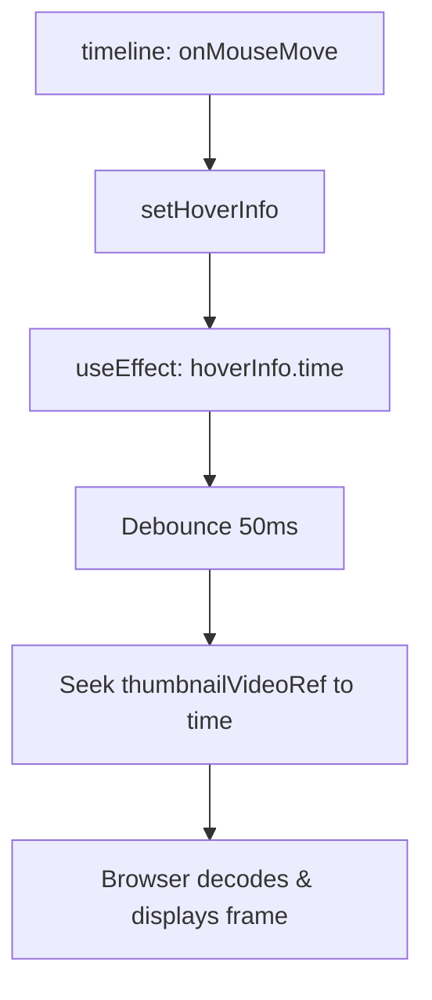

# Technical Implementation Plan: Timeline Hover Video Thumbnails

This document outlines the implementation plan for rendering video preview thumbnails on timeline hover.

## Phase 1: Planning & Architecture

### Component Architecture
We will modify the existing timeline tooltip in `VideoPlayer.jsx` to include a persistent preview video element.

- **Main Component**: `VideoPlayer` (`frontend/src/components/VideoPlayer.jsx`)
- **Child elements**:
  - A container `.timeline-tooltip-thumbnail-wrapper` wrapping a `<video>` element.
  - The video element `ref={thumbnailVideoRef}` loaded with the same source as the main player (`videoSrc`).

### State & Event Flow

## Phase 2: Implementation Steps

1. **CSS styling**:
   - Update `frontend/src/index.css` to add style rules for the preview container, video element, and styling adjustments for the tooltip.
   - Adjust the tooltip display from conditional React rendering (`{hoverInfo && ...}`) to CSS visibility rendering to ensure the thumbnail video is kept in DOM, preventing reloading on every hover entry.

2. **React Logic**:
   - Add `thumbnailVideoRef` to keep a reference to the thumbnail preview video.
   - Implement a `useEffect` that listens to `hoverInfo?.time` and updates `thumbnailVideoRef.current.currentTime` with a debounce/throttle of 50ms.
   - Change the timeline tooltip rendering in JSX from conditional display (`{hoverInfo && ...}`) to a persistently mounted element utilizing `opacity` and `visibility` based on `hoverInfo`.

## Phase 3: Risks & Mitigations

| Risk | Mitigation |
| --- | --- |
| Excessive seeking causes browser decoding lag or crashes. | Debounce/throttle seek requests in a `useEffect` hook by 50ms. Only perform seeks if the thumbnail video element exists and the target time has changed significantly. |
| Video load overhead on player mount. | Set `preload="auto"` and `muted` so the browser loads metadata efficiently. The browser will cache metadata and segments because the main video and thumbnail video share the exact same video URL. |
| Tooltip overflows the left/right screen bounds. | The existing tooltip positioning logic is already handled; we will ensure the thumbnail fits neatly within it. |

## Phase 4: Verification Checkpoints

- **Checkpoint 1 (CSS & HTML structure)**:
  - Verify the tooltip is always mounted but invisible until hovered.
  - Verify that when hovered, the preview container appears above the timeline cursor.
- **Checkpoint 2 (Thumbnail Seeking)**:
  - Verify that hovering on a specific timeline position seeks the preview video to that exact point.
  - Verify that moving the cursor rapidly updates the preview with a tiny debounced delay (50ms), preventing decoding freeze or lag.
- **Checkpoint 3 (UX & Aesthetics)**:
  - Verify the thumbnail aspect ratio remains consistent (16:9) and fits neatly into the existing player design system.
