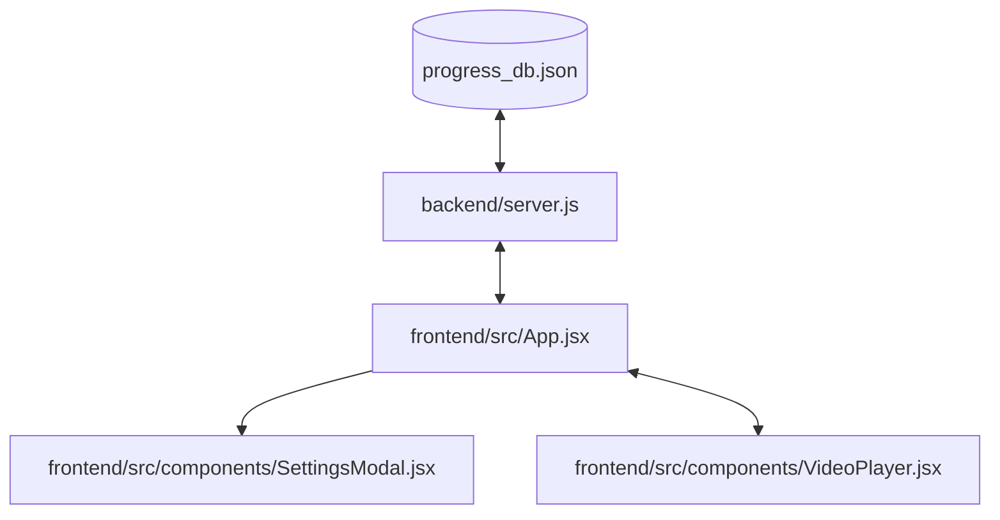

# Technical Implementation Plan: Autoplay Next Video

This plan outlines the sequential tasks needed to build and verify the Autoplay Next Video feature.

## 1. Major Components & Dependencies

- **Database/Backend (`backend/server.js`)**: Dependencies are minimal. We need to add `autoplayNext` to default settings and settings update handler.
- **App Core (`frontend/src/App.jsx`)**: Holds settings state. Needs to provide `onToggleAutoplay`, `hasNextLesson`, and `onPlayNextLesson` (which wraps `goToNextLesson`) to `VideoPlayer`.
- **Settings Modal (`frontend/src/components/SettingsModal.jsx`)**: Depends on App settings structure. Needs UI for toggling `autoplayNext`.
- **Video Player (`frontend/src/components/VideoPlayer.jsx`)**: Depends on video tag's `ended` event. Needs to handle countdown timer, toggle overlay, and custom visual transition prompt.

---

## 2. Implementation Order (Sequential)

### Step 1: Backend Settings Backfill & API Support
1. Modify `backend/server.js`'s `DEFAULT_SETTINGS` to include `autoplayNext: false`.
2. Update the `/api/userdata/settings` post handler to parse and persist `autoplayNext`.

### Step 2: Settings Modal UI Integration
1. Add a toggle (checkbox or custom styled switch) for "Autoplay Next Video" in `SettingsModal.jsx`.
2. Aligns with the other settings fields and includes user-friendly description.

### Step 3: App.jsx Integration
1. Add `autoplayNext: false` to `DEFAULT_SETTINGS` in `App.jsx`.
2. Define a function `handleToggleAutoplay` to flip `settings.autoplayNext` and save it to the backend.
3. Compute `hasNextLesson` by checking if there's any lesson following the current one in the course hierarchy.
4. Provide callbacks (`autoplayEnabled={settings.autoplayNext}`, `onToggleAutoplay={handleToggleAutoplay}`, `hasNextLesson={hasNextLesson}`, `onPlayNextLesson={goToNextLesson}`) to `<VideoPlayer />`.

### Step 4: VideoPlayer UI & Autoplay Logic
1. Add Autoplay control pill to the top-right overlay controls.
2. Bind `ended` listener to the HTML5 video element.
3. When `ended` fires:
   - Check if `autoplayEnabled` and `hasNextLesson` are true.
   - If yes, display the countdown overlay (starting at 5s) and start a `setInterval` timer.
   - Provide "Play Now" and "Cancel" buttons.
   - Clicking "Play Now" or timer hitting 0 triggers `onPlayNextLesson()`.
   - Clicking "Cancel" stops the timer and hides the overlay.

---

## 3. Risks & Mitigations

- **Risk**: Autoplay blocked by browsers when changing source.
  - *Mitigation*: The current player already has `autoPlay` and is triggered inside a user action context/interaction flow. By maintaining a user-approved sequence, the browser's autoplay policies will allow it.
- **Risk**: Video finished when user is actively seeking or near the end.
  - *Mitigation*: The countdown overlay should only show when the HTML5 `ended` event is raised, not just near the end, to prevent premature transitions.

---

## 4. Verification Checkpoints

### Checkpoint 1: Settings Persistence
- **Action**: Change Autoplay setting in Settings Modal.
- **Verify**: The setting value is reflected in `/api/userdata` network response and persists after page reload.

### Checkpoint 2: Autoplay Player UI Toggle
- **Action**: Click the Autoplay toggle in the top-right corner of the video player.
- **Verify**: The toggle changes state visually and updates the database settings.

### Checkpoint 3: Autoplay Transition & Countdown
- **Action**: Let a video play to the end (or seek close to the end).
- **Verify**:
  - Countdown overlay appears.
  - Timer counts down from 5 to 0.
  - At 0, the next lesson loads and plays.
- **Action**: Re-test, but click "Cancel".
- **Verify**: Countdown disappears and player stops on the finished video.
