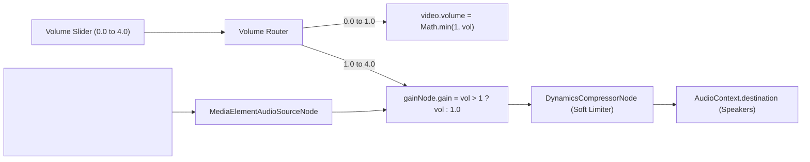

# Spec: Audio / Volume Boost (Unified 0% - 400% Slider)

## Objective
Provide a unified, seamless volume control directly on the existing player slider that allows users to adjust sound from 0% up to 400% (maximum boost). When volume exceeds 100%, the Web Audio API with soft limiting automatically engages to amplify the sound cleanly without digital clipping or distortion.

### User Stories & Acceptance Criteria
- **User Story 1:** As a user watching a quiet course video, I want to slide the existing volume slider past 100% all the way up to 400% to hear the instructor clearly.
- **User Story 2:** As a user, I want visual feedback on the slider (such as an amber color accent and a live percentage label like `150%` or `⚡ 250%`) so I know when audio boost is active.
- **User Story 3:** As a user, I want `ArrowUp` and `ArrowDown` shortcuts to smoothly adjust the unified volume (0% to 400%), with `Shift + ↑` and `Shift + ↓` allowing quick jumps (±50%), accompanied by toast notifications.
- **User Story 4:** As a user, I want clicking the percentage badge or volume icon to quickly reset volume to 100% or toggle mute.
- **User Story 5:** As a user, I want the boosted volume level to persist across lessons and app restarts via `localStorage`.

---

## Tech Stack
- **Frontend Framework:** React 19.2, Vite 8.0
- **Audio Processing:** Web Audio API (`AudioContext`, `MediaElementAudioSourceNode`, `GainNode`, `DynamicsCompressorNode`)
- **Icons & UI:** `lucide-react`, Vanilla CSS with CSS custom properties
- **Persistence:** Browser `localStorage` (`udemy-player-volume`, `udemy-player-muted`)

---

## Commands
- **Install dependencies:** `npm run install:all`
- **Start dev server (Backend + Frontend):** `npm run dev`
- **Build production bundle:** `npm run build --prefix frontend`
- **Package desktop app:** `npm run package`

---

## Architecture & Audio Pipeline

### Audio Pipeline Details
1. **Unified Volume Model (0 to 4.0):**
   - When `volume <= 1.0`: `video.volume = volume`, `gainNode.gain = 1.0` (unboosted, standard volume behavior).
   - When `volume > 1.0`: `video.volume = 1.0`, `gainNode.gain = volume` (amplified up to 4.0x / 400%).
2. **Soft Limiting Limiter:**
   - `DynamicsCompressorNode` with -3 dB threshold and 12:1 ratio ensures amplified audio peaks never exceed 0 dBFS or crackle speakers.
3. **Re-connection Safety:**
   - `WeakMap` prevents duplicate `MediaElementAudioSourceNode` creation when `<video>` elements remount.
4. **Volume Change Event Loop Protection:**
   - HTMLMediaElement only reports volume in the range `[0, 1]`. The player's `volumechange` listener must not clamp state back down to 1.0 when boost is active.

---

## UI / UX Design

1. **Volume Control Group:**
   - **Mute / Volume Icon:** Displays `<VolumeX />` (muted or 0%), `<Volume1 />` (< 50%), `<Volume2 />` (>= 50%), or `<Volume2 style={{ color: 'var(--accent-amber)' }} />` with a `⚡` glow when `volume > 1.0`.
   - **Slider Track & Magnetic Snapping:**
     - Range: `min="0"`, `max="4"`, `step="0.05"`.
     - Width expands smoothly on hover/focus (expanded to 85px to give precise control across the 400% range).
     - **100% Notch & Magnetic Snap:** A visible notch indicator is rendered at the 25% position (100% volume mark). When dragged within ±7% around 100%, the slider magnetically snaps to exactly 1.0 (100%) for effortless return to normal volume.
     - Standard track color (`--primary`) when `volume <= 1.0`.
     - Highlighted amber track and thumb (`--accent-amber`) when `volume > 1.0`.
   - **Percentage Badge:**
     - Displays current level: e.g. `80%`, `100%`, `⚡ 150%`, `⚡ 400%`.
     - When `volume > 1.0`, turns amber. Clicking it resets volume back to `100%`.
2. **Keyboard Shortcuts:**
   - `ArrowUp`: Increases volume by 10% (0.1), seamlessly continuing past 100% up to 400%.
   - `ArrowDown`: Decreases volume by 10% (0.1) down to 0%.
   - `Shift + ArrowUp`: Quick-boost up by 50% (0.5), up to 400%.
   - `Shift + ArrowDown`: Quick-boost down by 50% (0.5), down to 0%.
   - `M`: Toggle mute (retains the boost level when unmuted).

---

## Boundaries
- **Always:**
  - Keep `video.volume` within legal DOM range `[0, 1]`.
  - Use `DynamicsCompressorNode` soft limiter on Web Audio to prevent digital clipping at high boost (up to 400%).
  - Ensure `localStorage` saves and restores user volume accurately.
- **Never:**
  - Let HTMLMediaElement's `volumechange` event clamp user boost volume back down to 1.0.
  - Break standard video playback or mute functionality.

---

## Phase 2: Implementation Plan

1. **AudioBooster Utility Updates (`frontend/src/utils/audioBooster.js`):**
   - Ensure support for gains up to 4.0x.
2. **Player Volume State & Synchronization (`frontend/src/components/VideoPlayer.jsx`):**
   - Extend `volume` state to support range `0` to `4.0`.
   - Sync `video.volume = Math.min(1, volume)` and `audioBooster.setBoost(volume > 1 ? volume : 1)`.
   - Prevent `handleVolumeChange` event from downgrading boost state when `video.volume === 1`.
   - Update the volume slider: `min="0"`, `max="4"`, `step="0.05"`.
   - Add inline percentage indicator (`100%`, `⚡ 250%`) with click-to-reset.
   - Remove the now redundant standalone cycle button.
3. **Keyboard Shortcuts & Toasts (`frontend/src/App.jsx`):**
   - Update `ArrowUp` / `ArrowDown` in `App.jsx` to coordinate 0% to 400% volume adjustment.
   - Update `Shift + ArrowUp` / `Shift + ArrowDown` for ±50% quick adjustments.
   - Toast displays `🔊 XX%` (<= 100%) and `⚡ XX%` (> 100%).
4. **Styling & Shortcuts Sheet (`frontend/src/index.css`, `KeyboardShortcutsModal.jsx`):**
   - Update `.volume-slider` styles: wider expansion on hover, `.boosted` class with amber styling.
   - Update `KeyboardShortcutsModal.jsx` to explain 0%–400% volume control.
5. **Verification & Packaging:**
   - Test build and verification.

---

## Phase 3: Tasks Breakdown

- [x] **Task 1: AudioBooster Utility Extended to 400%**
  - **Acceptance:** `frontend/src/utils/audioBooster.js` supports gains up to 4.0x with `DynamicsCompressorNode` soft limiter and `WeakMap` reconnect protection.
  - **Verify:** Tested with multiplier up to 4.0.
  - **Files:** `frontend/src/utils/audioBooster.js`

- [x] **Task 2: Unified Volume State & Keyboard Shortcuts (0% - 400%)**
  - **Acceptance:** `App.jsx` coordinates volume from 0 to 4.0 with `localStorage` persistence, `ArrowUp`/`ArrowDown` (±10%), and `Shift+↑`/`Shift+↓` (±50%), with live toast notifications.
  - **Verify:** Shortcuts adjust volume across full range; toasts reflect level accurately.
  - **Files:** `frontend/src/App.jsx`

- [x] **Task 3: Unified Slider (0-400%) & Percentage Badge in VideoPlayer**
  - **Acceptance:** `VideoPlayer.jsx` renders slider with `min="0"`, `max="4"`, `step="0.05"`, and a percentage badge with `⚡` icon that resets to 100% on click.
  - **Verify:** Slider adjusts smoothly from 0% to 400%; audio volume audibly changes; clicking badge resets to 100%.
  - **Files:** `frontend/src/components/VideoPlayer.jsx`

- [x] **Task 4: UI Styling & Shortcut Documentation**
  - **Acceptance:** `index.css` styles the slider with wider hover expansion (85px), amber track/thumb when boosted, and an illuminated volume badge. `KeyboardShortcutsModal.jsx` lists 0%–400% controls.
  - **Verify:** Visuals match existing dark theme and amber accent.
  - **Files:** `frontend/src/index.css`, `frontend/src/components/KeyboardShortcutsModal.jsx`

- [x] **Task 5: Production Build & Desktop App Packaging**
  - **Acceptance:** `npm run build --prefix frontend` and `npm run package` both succeed with exit code 0.
  - **Verify:** Packaged DMG artifact generated successfully.
  - **Files:** `dist-desktop/Udemy Offline Player-1.20.0-arm64.dmg`
